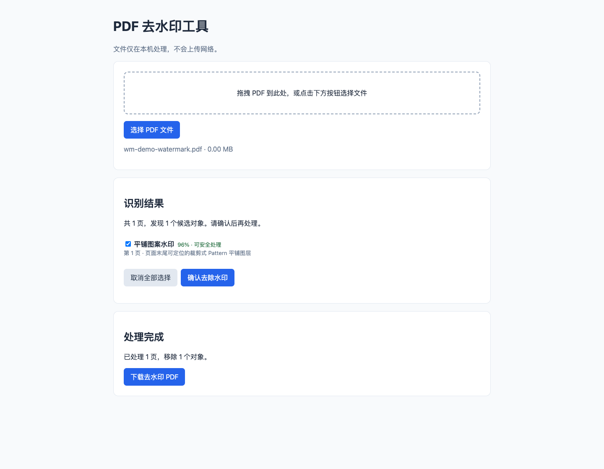

# Local PDF Watermark Remover

[简体中文](README.md)

A local-first PDF utility. Import a PDF, review recognizable tiled Pattern watermark candidates, confirm, and export a new file. PDF contents are processed locally and are not uploaded to a remote service. The original file is never overwritten.



> **Current scope**: Version 0.1 only removes a recognizable clipped Pattern tiling block at the end of a page content stream. It does not remove watermarks baked into scans, watermarks merged into page backgrounds, ordinary text/image/transparency-group watermarks, or structurally different Pattern objects. No detection result does not mean a PDF is watermark-free.

## Install and run

Python 3.9 or newer is required.

```bash
git clone https://github.com/hon0516/pdf-watermark-remover.git
cd pdf-watermark-remover
python -m venv .venv
source .venv/bin/activate  # Windows: .venv\Scripts\activate
python -m pip install .
python -m watermark_remover
```

Open <http://127.0.0.1:8765>, select or drop a PDF, review the detected candidates, and confirm the export.

For development:

```bash
python -m pip install -e .
python -m unittest discover -s tests -v
```

## Configuration

```bash
python -m watermark_remover --host 127.0.0.1 --port 8765
```

| Setting | Default | Description |
| --- | --- | --- |
| `--host` | `127.0.0.1` | Bind address. Keep the loopback default to avoid exposing the document tool to a network. |
| `--port` | `8765` | Local web server port. |
| `WM_MAX_BYTES` | `52428800` | Maximum upload size in bytes. |
| `WM_MAX_PAGES` | `100` | Maximum number of pages per PDF. |
| `WM_TASK_TTL` | `3600` | Seconds before temporary input and output files are removed. |
| `WM_TEMP_DIR` | `.wm-tasks` | Temporary task directory. |

## Privacy and security

- The server binds to `127.0.0.1` by default; document contents are not sent over the internet.
- Uploaded files are stored only in the configured temporary directory and are removed when the task expires.
- Uploaded filenames have path components removed before they are used on disk.
- The default limits are 50 MiB per file and 100 pages.
- Processing writes a new PDF and never overwrites the source.
- Process only files you own or are authorized to modify, and inspect the output before using it.

## Known limitations

- Detection depends on PDF content-stream structure. The tool does not use OCR or repair pixel watermarks in scanned images.
- Automatic removal is currently limited to a clipped, tiled Pattern paint block at the end of a page stream. Other PDF generators may encode watermarks differently.
- Do not use an output if page content is missing or visually incorrect. Report issues with a minimal sample that contains no personal information.
- PDF parsers have inherent risks. Process files from trusted sources and keep dependencies updated.

## Contributing

See [CONTRIBUTING.md](CONTRIBUTING.md). Vulnerability reporting instructions are in [SECURITY.md](SECURITY.md).

## License

MIT License. See [LICENSE](LICENSE).

See [CHANGELOG.md](CHANGELOG.md) for release history.
